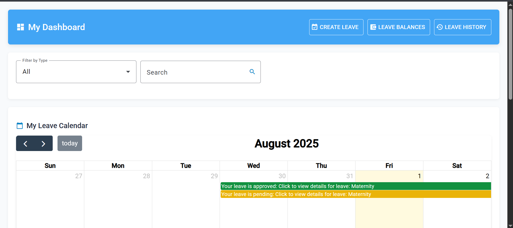

# 🗓️ Leave Management System

A full-stack Leave Management System built using **Angular** for the frontend and **Express.js** for the backend. This system allows employees to register, log in, and apply for leave based on leave types and available balances. Admins can manage users and review leave requests.

---

## 🚀 Features

- User registration and login with password management.
- Role-based dashboards for **Staff** and **Admin**.
- Leave application form with dynamic balance deductions.
- Leave types configuration (e.g., Annual, Sick, Casual).
- Admin dashboard to manage:
  - Staff leave requests
  - User accounts
  - Leave types and balances

---

## 🧑‍💻 Technologies Used

| Layer         | Technology     |
|---------------|----------------|
| Frontend      | Angular        |
| Backend       | Express.js     |
| Database      | MySQL |
| Authentication | JWT / Session-based (as implemented) |

---

## 📸 Screenshots

### 1. 🔐 Home Page
> Allows users to securely log in and set a password during registration.


---

### 2. 🔐 Login & Password Setup
> Allows users to securely log in and set a password during registration.


---
### 3. 📊 Staff Dashboard
> Users can view their current leave balances, request new leave, and see status updates.



---

### 4. 🧑‍💼 Admin Dashboard
> Admin users have access to manage staff, approve or reject leave, and view analytics.


---

### 5. 📝 Leave Request Form
> Users can select leave type, enter dates, and submit the request. Leave balances are auto-updated.


---

### 6. 📂 Leave Records Overview
> Staff and admins can view history of leave applications and decisions.


---
### 7. 📂 Leave Details Overview
> Staff and admins can view history of leave applications and decisions.


---

## 🛠️ Installation Guide

1. **Clone the Repository**
   ```bash
   git clone https://github.com/your-username/leave-management-system.git
   cd leave-management-system
   ```

2. **Backend Setup**
   ```bash
   cd backend
   npm install
   npm start
   ```

3. **Frontend Setup**
   ```bash
   cd frontend
   npm install
   ng serve
   ```

4. **Environment Configuration**
   - Configure database connection in `backend/config/db.js`
   - Set up your `.env` file for JWT secrets and port settings

---

## 🔐 User Roles

- **Staff**:
  - Apply for leave
  - View status and balances

- **Admin**:
  - Approve or decline leave
  - Manage users and leave types

---

## 📅 Leave Logic

- When a user applies for leave, their **available balance** for that leave type is checked.
- Upon approval, the balance is **automatically deducted**.
- Admins can configure or reset balances at any time.

---

## 🤝 Contribution

Pull requests and suggestions are welcome! If you'd like to contribute, fork the repo and submit a PR.

---

## 📝 License

This project is licensed under [MIT](LICENSE).
